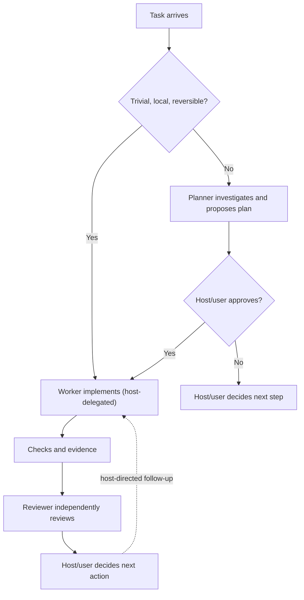
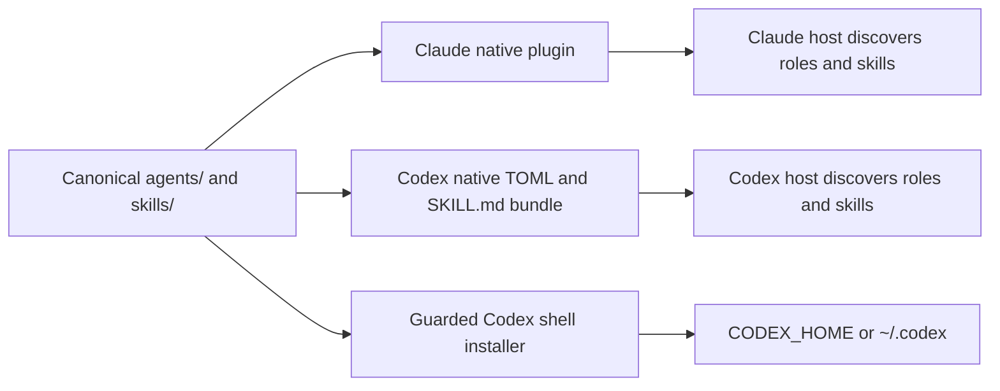

# ldo-ai

`ldo-ai` packages planner, worker, and reviewer guidance for native Claude Code and Codex. This is an incompatible reset: the custom LDO workflow runtime was removed. There is no router, automatic pipeline, Pi support, legacy workflow compatibility, Recorder, or Researcher role.

## How work flows

Hosts decide whether and when to delegate. The roles are available for use, not a forced pipeline.



## Install

### Claude Code

In Claude Code, run:

```text
/plugin marketplace add aadegtyarev/ldo-ai
/plugin install ldo@ldo-ai
```

Update with `/plugin update ldo@ldo-ai`; remove with `/plugin uninstall ldo@ldo-ai`. For checkout development, launch `claude --plugin-dir /path/to/ldo-ai`.

### Codex CLI 0.161.0+

Install from the Git marketplace with:

```sh
codex plugin marketplace add https://github.com/aadegtyarev/ldo-ai.git
codex plugin add ldo-ai@ldo-ai
```

Update the marketplace and installed plugin with `codex plugin marketplace upgrade ldo-ai`, then `codex plugin add ldo-ai@ldo-ai`. Remove the plugin and marketplace with `codex plugin remove ldo-ai@ldo-ai` and `codex plugin marketplace remove ldo-ai`. For checkout development, register the local checkout instead of the Git URL: `codex plugin marketplace add /path/to/ldo-ai`; after editing sources, rerun `codex plugin add ldo-ai@ldo-ai`.

The Codex marketplace manifest points to `.codex-plugin/`, which packages three agents and five conditional skills. Both host packages use shared role/skill guidance, with native host-specific adapters:



### Older Codex CLI: shell fallback

Run `./scripts/install-codex.sh`; it writes to `$CODEX_HOME/{agents,skills}` or `~/.codex/{agents,skills}`. An optional agents-directory argument selects another target; skills go in its sibling `skills/` directory. Rerunning updates only package-marked role TOMLs and skill `SKILL.md` files. Preflight refuses unowned files and symlink collisions; unrelated files and directory contents remain. Updates replace local edits to owned files. Remove owned files with `./scripts/install-codex.sh --uninstall [agents-directory]`.

## First task

Ask the planner to inspect the repository and propose a small plan, approve it before asking the worker to implement, then ask the reviewer to inspect the diff and checks independently. Roles: planner plans, worker implements approved work, reviewer checks evidence. The package includes native skills for workflow, decomposition, security, validation, and Git delivery; hosts decide when to load them. The host controls delegation, execution, approvals, and final decisions.

## Contribute

Requires Node.js 18+; there are no third-party dependencies. Run `npm test`, `npm run check`, and `sh -n scripts/install-codex.sh`. CI runs no model calls. `npm test` covers the shell installer and, when installed, the Codex marketplace lifecycle in a temporary `CODEX_HOME`; package checks validate manifests, shared bundle contents, versions, routing, size limits, and legacy-path removal.

There is no legacy LDO workflow or configuration compatibility. Agent behavior depends on host version and native subagent support.

The package is MIT licensed; see [LICENSE](LICENSE). Read [CHANGELOG.md](CHANGELOG.md) for release history and [the source repository](https://github.com/aadegtyarev/ldo-ai) for code and contribution context.
